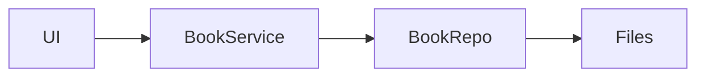
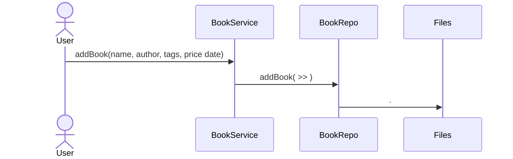
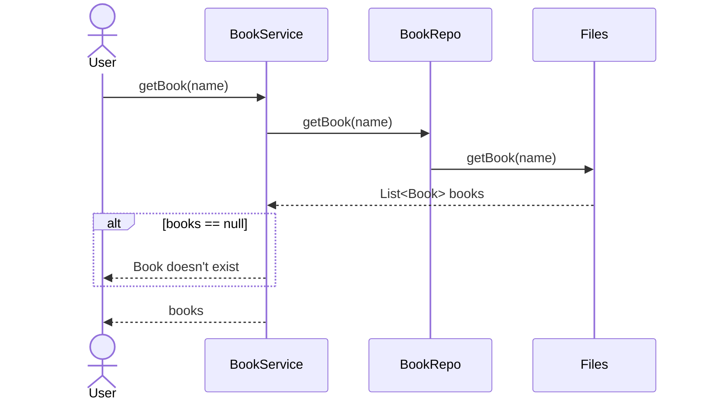
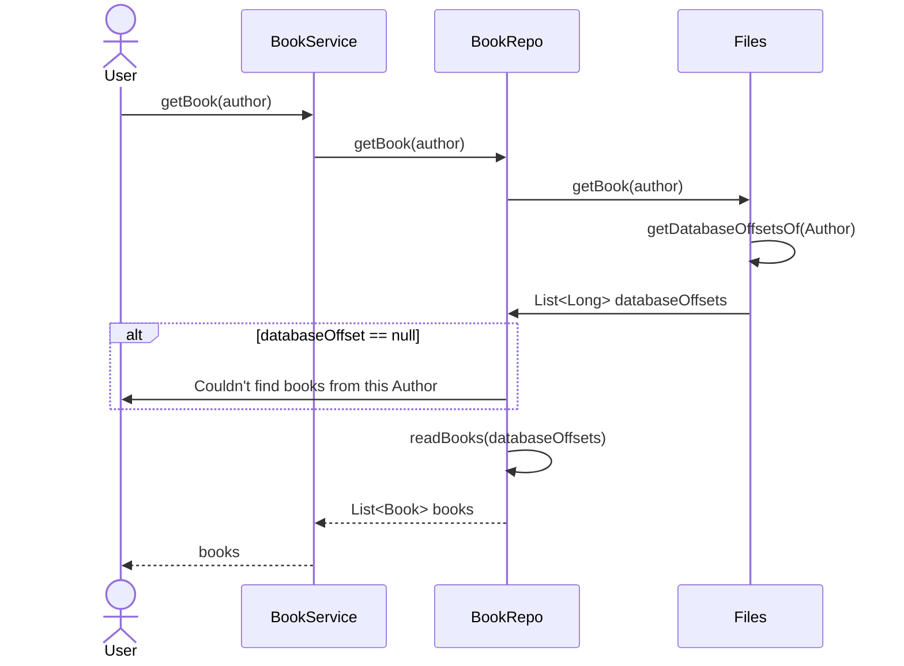
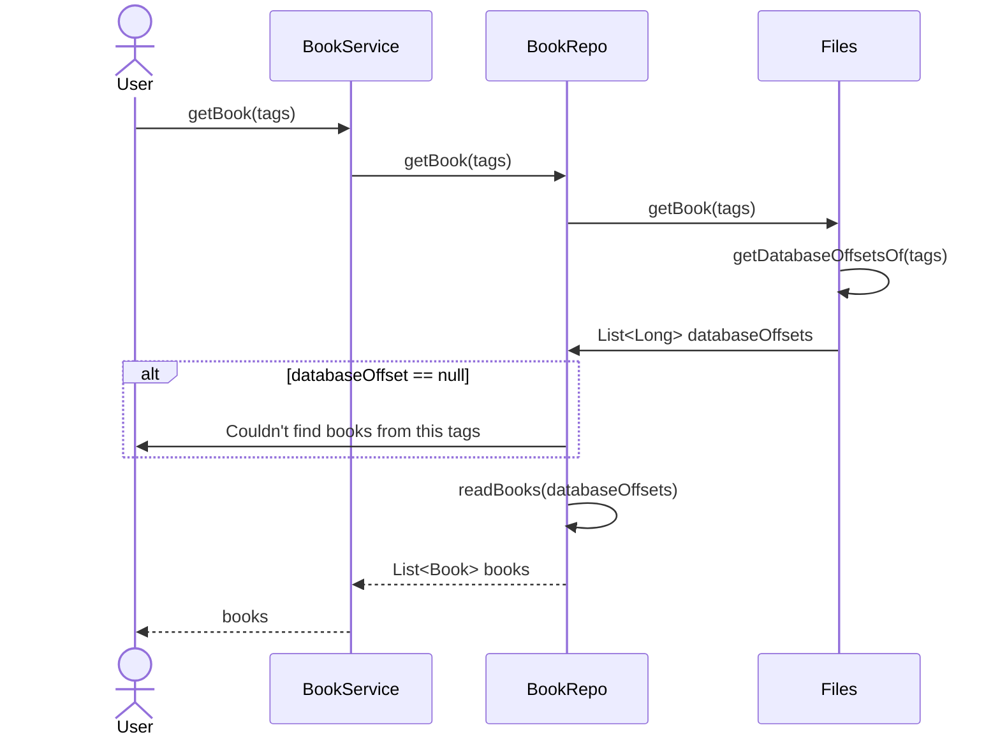
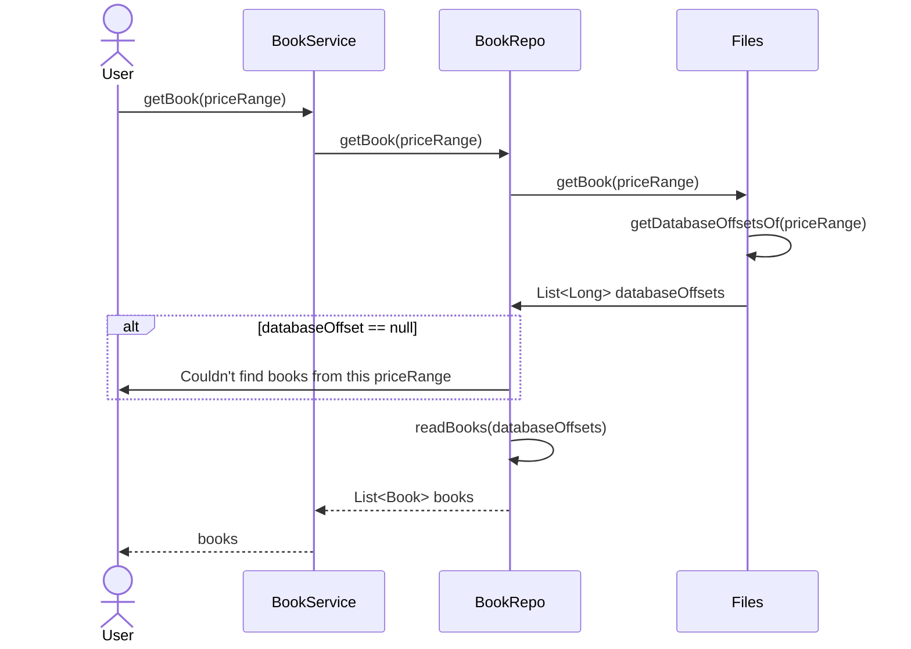
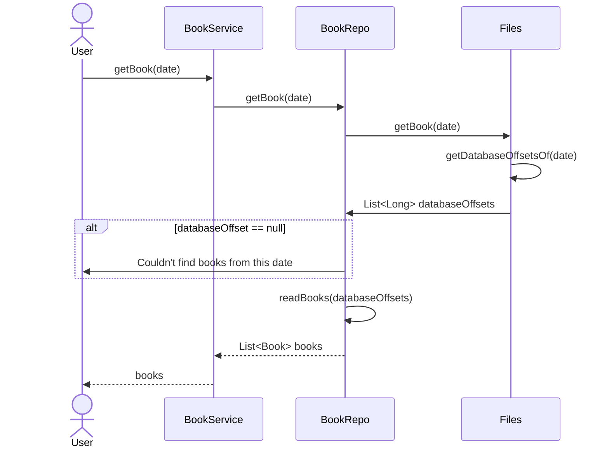

### High Level Architecture


[//]: # (- Server)

[//]: # (```mermaid)

[//]: # (flowchart LR)

[//]: # (    TCP_Server --> Controller --> Service --> Repo --> Files)

[//]: # (```)


## Add new book:


## Search book by name:


## Search book by author:


## Search book by Tags:


## Search book by Price:


## Search book by Date:


