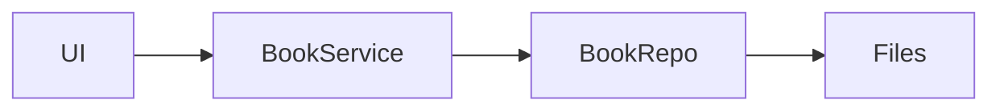

### High Level Architecture
- 
- Client


[//]: # (- Server)

[//]: # (```mermaid)

[//]: # (flowchart LR)

[//]: # (    TCP_Server --> Controller --> Service --> Repo --> Files)

[//]: # (```)
### Book:
- String name
- String Author
- List\<Tag> tags
- Double price
- Date date

