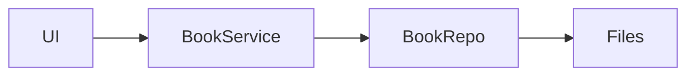

### High Level Architecture
-

```mermaid
flowchart LR
    UI --> BS[BookService] --> BR[BookRepo] --> Files
```


[//]: # (- Server)

[//]: # (```mermaid)

[//]: # (flowchart LR)

[//]: # (    TCP_Server --> Controller --> Service --> Repo --> Files)

[//]: # (```)
