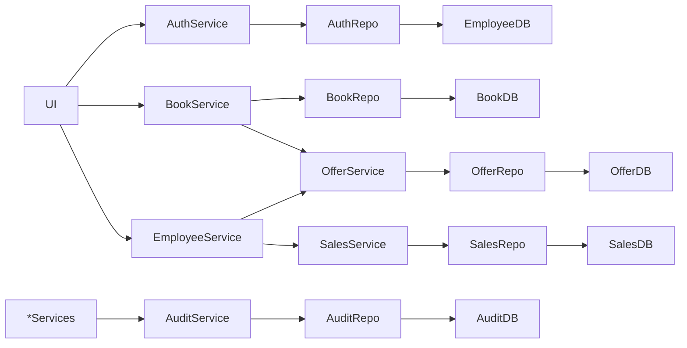
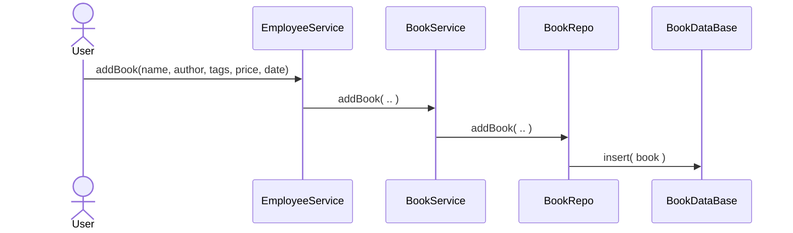
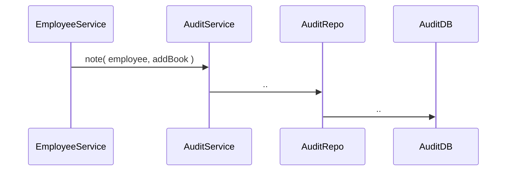
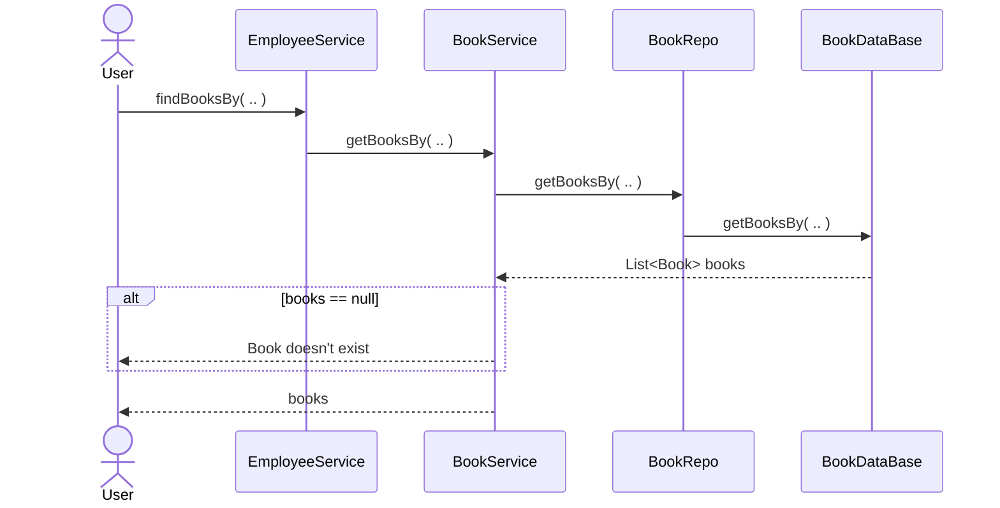
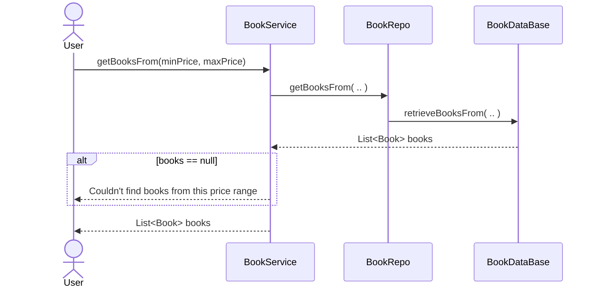
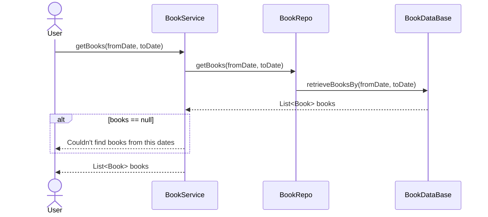
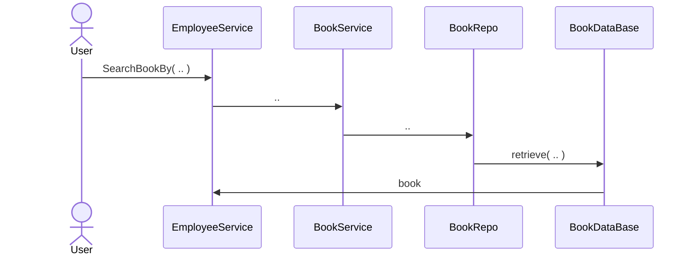
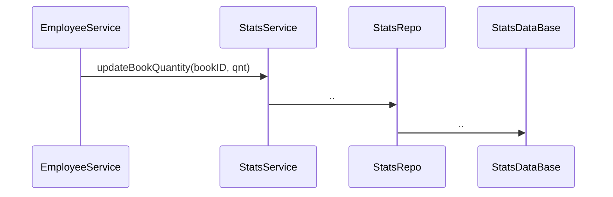
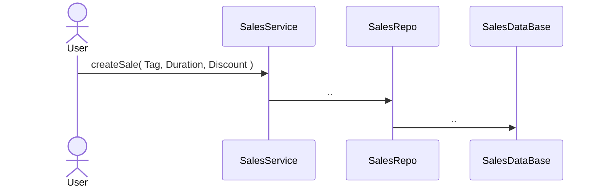

# High Level Architecture


[//]: # (- Server)

[//]: # (```mermaid)

[//]: # (flowchart LR)

[//]: # (    TCP_Server --> Controller --> Service --> Repo --> Files)

[//]: # (```)


## Add-Modify-Remove  book:



## Search book:


``` *Audit Update ```


## Search book by Price:

``` *Audit Update ```

## Search book by Date:

``` *Audit Update ```

## Sell Book:


``` *Audit Update ```

## Create Sale:

``` *Audit Update ```
