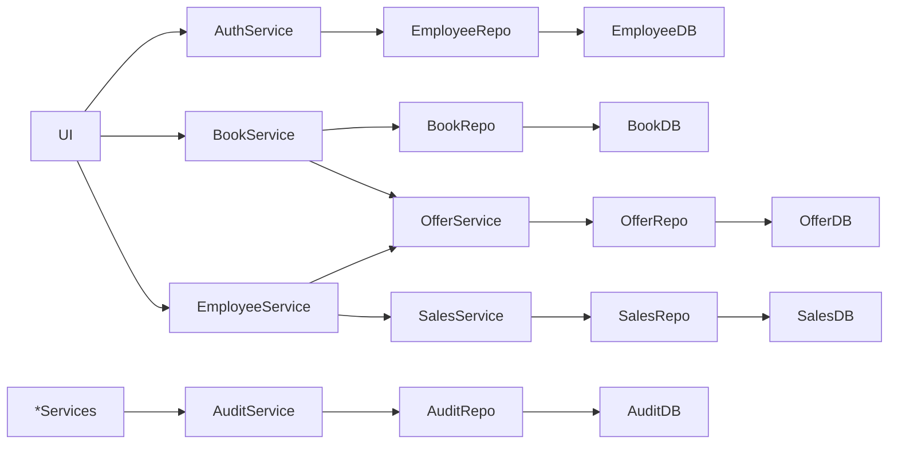
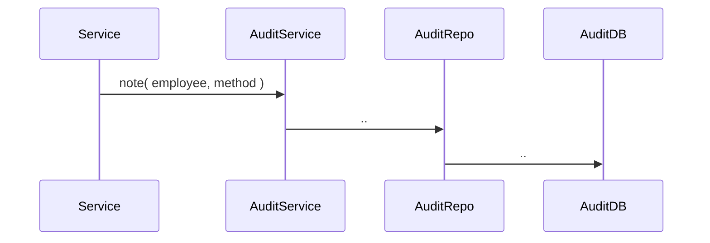
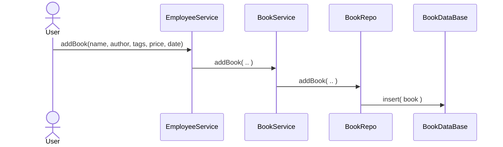
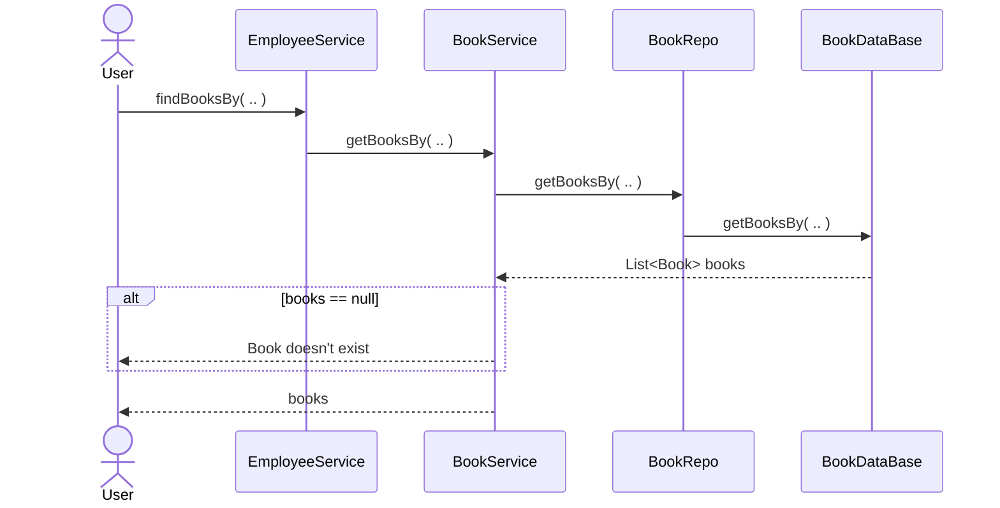
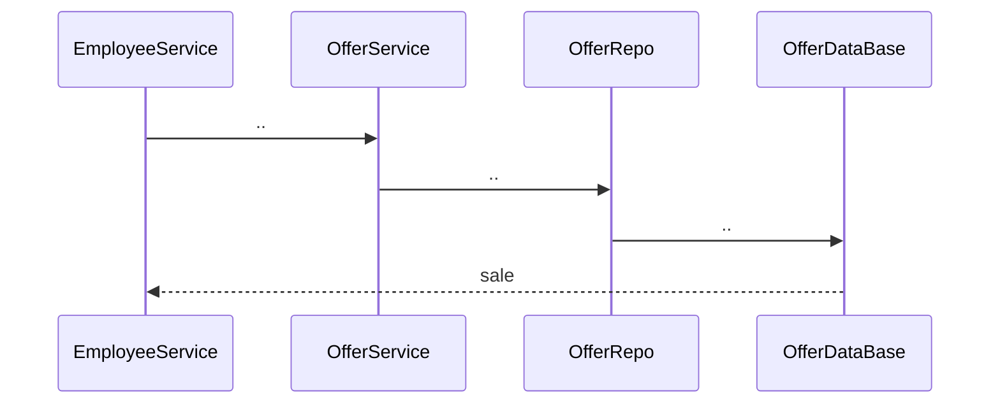
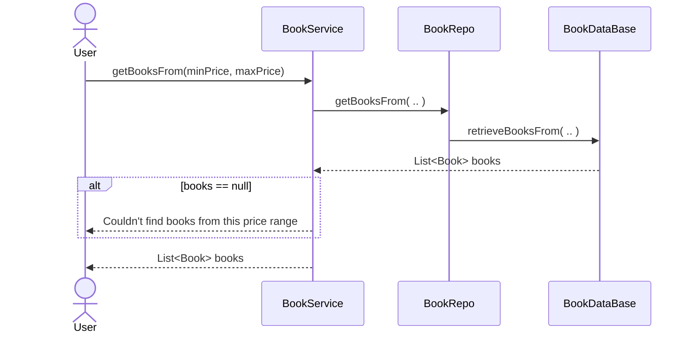
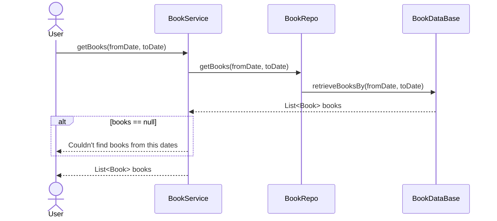
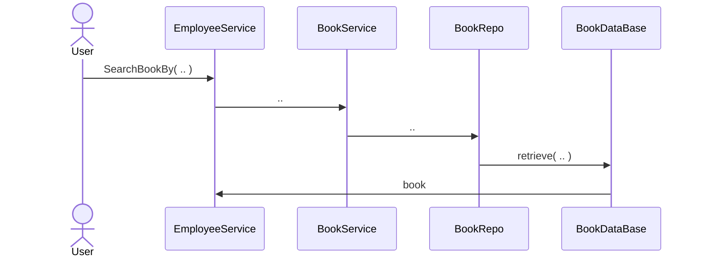
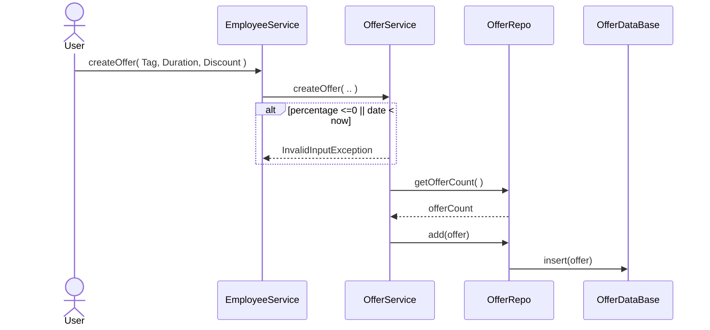

# High Level Architecture


[//]: # (- Server)

[//]: # (```mermaid)

[//]: # (flowchart LR)

[//]: # (    TCP_Server --> Controller --> Service --> Repo --> Files)

[//]: # (```)

## Audit:


## Add-Modify-Remove  book:

[*Audit update](#audit)


## Search book:


[*Audit update](#audit)


## Search book by Price:

[*Audit update](#audit)

## Search book by Date:

[*Audit update](#audit)

## Sell Book:


```**Check if the book has an offer``` <br>
[*Audit update](#audit)

## Create Offer:

[*Audit update](#audit)
